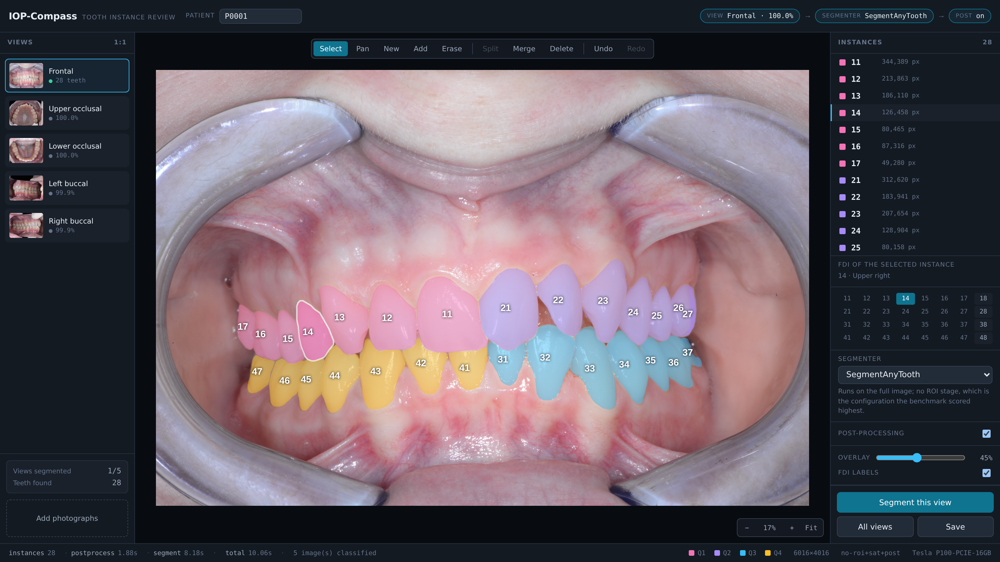

# 🦷 IOP-Compass

<p align="center">
  
</p>

A clinical viewer and annotation tool for multi-view intraoral photographs.
Standardised five-view photographs are assigned their clinical view, segmented
into FDI-numbered tooth instances, and presented in a correction interface where a
clinician verifies and fixes the result. Built on human-verified FDI tooth-instance
annotations, with baselines for view classification and tooth instance
segmentation.

---

## The pipeline

A clinician uploads a patient's photographs. Each one is assigned its clinical view,
then segmented into FDI-numbered tooth instances:

```
photographs → view classification → SegmentAnyTooth (full image) → post-processing → FDI instances
                  ResNet18              no ROI stage                  frozen rules
```

Two design choices in that chain:

- **No ROI stage.** The viewer segments the full image and crops nothing.
- **Post-processing on.** Frozen rules clean up the segmenter output; they run after
  the forward pass in both segmenter paths.

**Mask R-CNN** is offered as the second segmenter, also on the full image, and is
faster. Both are selectable in the viewer.

---

## Dataset & Weights

> **Download:** <https://ditto.ing.unimore.it/iop-compass/>
>
> Note: for model weights drop us an email at federico.bolelli[at]unimore.it 

The viewer needs exactly two weights:

| file | what it is |
| --- | --- |
| `view_classifier.pt` | ResNet18 five-view orientation classifier — assigns each photograph its clinical view |
| `maskrcnn.pt` | Mask R-CNN R50-FPN tooth-instance segmenter |

**SegmentAnyTooth (SAT) weights** are the default segmenter but are covered by a
separate non-commercial licence and are **not redistributed here**. To obtain them,
email the maintainers. Once you have them, point `SAT_WEIGHT_DIR` and `SAT_CODE_DIR`
at them.

The viewer does not apply an ROI stage, so no ROI-detector, geometric-prior or SAM 3
weights are needed.

---

## Quick start

```bash
python -m venv .venv && source .venv/bin/activate
pip install -r requirements-lock.txt
python scripts/fetch_third_party.py     # link SegmentAnyTooth weights (obtain them by email)
```

**Run the viewer** (API on :5000, UI on <http://localhost:5173>):

```bash
cd app && make install     # frontend dependencies, once
make check                 # confirm every weight is present before starting
make dev                   # backend and UI together
```

`make check` names any missing file and the environment variable that relocates it,
rather than failing on the first clinical image. To serve one segmenter only:
`make backend SEGMENTERS=sat`.

**Run the models on your own images**, without the viewer — see
[`docs/inference.md`](docs/inference.md) for the copy-pasteable version:

```python
from iop_compass.segmentation.segmentanytooth_adapter import SegmentAnyToothRunner
from iop_compass.segmentation.postprocessing import PostProcessParams, postprocess_instances

runner = SegmentAnyToothRunner(weight_dir="third_party/sat_weights", device="cuda")
prediction = runner.predict(image_bgr, view_label="frontal")
masks, fdis, scores, _ = postprocess_instances(
    prediction.masks, prediction.fdis, prediction.scores,
    roi_mask=None, exclusion_mask=None,
    params=PostProcessParams.from_yaml("configs/segmentation/postprocessing.yaml"),
    view_label="frontal",
)
```

---

## Layout

```
app/                  the viewer: Flask backend + React frontend
configs/              dataset, classification and segmentation configuration
docs/                 inference and the viewer
internal/             cluster-specific submission tooling, not needed to use the release
scripts/              audit, manifest, splits, training, inference, evaluation, figures
src/iop_compass/
  data/               adapter, manifest, rasterisation, validation, splits, imaging
  classification/     dataset, model, training, constrained assignment, metrics
  roi/                the four ROI strategies, factory, ROI-only evaluation
  segmentation/       SegmentAnyTooth adapter, Mask R-CNN, post-processing,
                      matching, metrics, the benchmark grid, inference
  reporting/          aggregation, bootstrap, figures, labels, qualitative panels
tests/                leakage, manifest, label mapping, matching, metrics, grid
```

`results/` and `runs/` are produced by a campaign and are not tracked.

---

## Benchmark tasks

| task | variants |
| --- | --- |
| View classification | C0 pretrained, no augmentation · C1 pretrained + clinically plausible augmentation · C2 from scratch. C1 also evaluated with patient-set constrained assignment. |
| ROI extraction | full image · view-specific geometric prior fitted on training annotations · learned single-box detector · SAM 3 concept prompts with a documented full-image fallback. |
| Tooth instance segmentation | The full ROI × segmenter × post-processing grid: 4 × 2 × 2 = 16 cells, every cell through one code path so the axes are not confounded with a per-backend crop convention. |

---

## Citation

The dataset is publicly available at
<https://ditto.ing.unimore.it/iop-compass/>.
